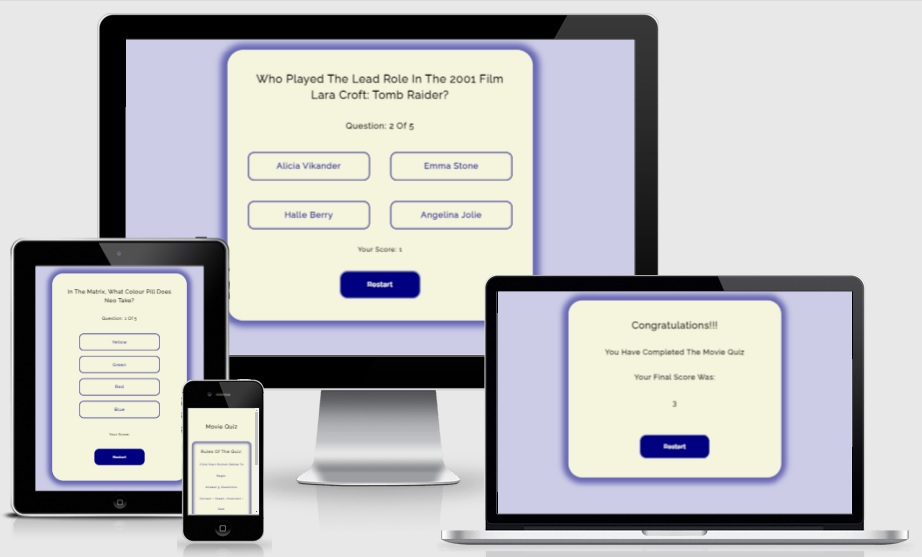

# Movie Quiz

Movie Quiz is a fun and interactive quiz that follows a multiple choice format. It allows the movie fan to test their knowledge of all things movies to see if they really know as much about movies as they think they do!!!

Some of its key features include:

* Easy to follow instructions are given,
* Multiple choice format questions,
* The movie fan will know instantly if they choose the correct answer,
* Score is updated instantly,
* Next question appears automatically,
* Total score is given at end of quiz,
* The option to restart quiz is always available.

## The Website

 

 

This website is hosted by GitHub pages and can be viewed at:  
[Movie Quiz](https://shanecoen.github.io/code-institute-portfolio-2/index.html)

## **Contents**

* [**The Design Process**](<#the-design-process>)
    * [UX Design](<#ux-design>)
    * [User Stories](<#user-stories>)
    * [Responsively Designed](<#responsively-designed>)
    * [Semantic HTML](<#semantic-html>)
    * [Wireframes](<#wireframes>)
    * [Site Structure](<#site-structure>)
    * [Design Choices](<#design-choices>)
        * Typography
        * Colour Scheme
* [**Features**](<#features>)
    * [Existing Features](<#existing-features>)
        * [Common To All Pages](<#common-to-all-pages>)
            * Large Call To Action Buttons
        * [Quiz Rules](<#quiz-rules>)
        * [Quiz Question](<#quiz-question>)
        * [Quiz Number](<#quiz-number>)
        * [Quiz Answer Option Buttons](<#quiz-answer-option-buttons>)
        * [Current Score](<#current-score>)
        * [Final Page And Final Score](<#final-page-and-final-score>)
    * [Future Features](<#future-features>)
* [**Technologies Used**](<#technologies-used>)
* [**Testing**](<#testing>)
    * [Code Validation](<#code-validation>)
    * [Website Responsiveness](<#website-responsiveness>)
    * [Browser Compatability](<#browser-compatability>)
    * [Testing User Stories](<#testing-user-stories>)
    * [Lighthouse Testing](<#lighthouse-testing>)
    * [Known Bugs](<#known-bugs>)
        * Resolved Bugs
        * Unresolved Bugs
* [**Deployment**](<#deployment>)
    * [GitHub Pages](<#github-pages>)
    * [To Fork A Repository On GitHub](<#to-fork-a-repository-on-github>)
    * [Creating A Local Clone Of Website Files From GitHub](<#creating-a-local-clone-of-website-files-from-github>)
* [**Credits**](<#credits>)
    * [Website Content](<#website-content>)
    * [Code](<#code>)
* [**Acknowledgements**](<#acknowledgements>)

## **The Design Process**

### UX Design:

It was designed using the 5 principles of UX Design (strategy, scope, structure, skeleton and surface) in order to develop a website that fully meets the user's needs.

### User Stories:

* As a movie fan I want to be able to understand the websites purpose instantly upon loading it.
* As a movie fan I want to view an aesthetically pleasing website.
* As a movie fan I want to be able to play a fun and interactive quiz.
* As a movie fan I want its functionality to be clear from the outset.
* As a movie fan I want a challenging quiz.
* As a movie fan I want to be able to keep track of how many questions are in the quiz.
* As a movie fan I want to be able to keep track of my score as I progress.
* As a movie fan I want to be able to restart the quiz if desired.
* As a movie fan I do not wish to be presented with the same questions again if I restart quiz. I want questions randomized.

### Responsively Designed:

This website has been designed Mobile First as priority and huge importance has been put into this area to ensure that it functions responsively on all devices be it mobile, tablet and desktop screen sizes.

### Semantic HTML:

Wherever possible Semantic HTML5 elements were used in order to have the HTML code structured correctly and to enure that the code is accessible to all users.

### Wireframes:

Wireframes were an integral part of the design process for this website. They were used as a visual representation of the initial ideas for the architecture of the site i.e. the organisation of all pages and features etc. It was very important to be able to visualise how this website would look and function whether it was in Mobile, Tablet or Desktop view. Balsamiq was used in the production of wireframes for this website and it helped greatly in the development process when the decison had to be made as to what features etc were to be included. Some of the wireframes used can be seen in the image below and show desktop and mobile view side by side. (note: wireframe sizes are not to scale).

 

### Site Structure:

The Movie Quiz consists of three seperate pages i.e. Home page, the Quiz page and the final results page. The home page is the default landing page and the quiz page can be assessed once the user clicks on the start button. The final results page can only be assessed once the user has completed the quiz. At all times the user has the option of returning to the homepage via the large restart button making navigation very accessible.

### Design Choices:

* Typography

The font chosen for this website is "Raleway" for all headings and body text with a fallback option of "Sans-Serif". This font was chosen as it is aesthetially pleasing and is easy to read for the user. Google Fonts was used to aquire this font.

* Colour Scheme

The colour scheme chosen for the website consists of navy (#000080) and beige (#f5f5dc). These were chosen as they have a good contrast with one another and make viewing and interacting very accessible for the user.

 

[Back To Contents](<#contents>)

## **Features**

The Movie Quiz was responsively designed with the user in mind in that it is a very
welcoming and easy to use website. Users will instantly be able to navigate throughout the site
easily and all interactive features such as the quiz answers and buttons are very user friendly. 

### Existing Features:

#### Common To All Pages:

* Large Call To Action Buttons

These Call To Action Buttons can be found on each page. They are large in size and easily recognisible to the user that they are to be clicked and
are used to easily navigate between different sections if desired. They are a quick way for the user to either begin or restart quiz and return to the homepage. They are bright in colour and when hovered over they change background and font colour.

 

#### Quiz Rules:

This can be found on the main quiz homepage and can be viewed instantly upon loading. It gives the user a quick rundown of how the quiz functions and what the user can expect once they begin the quiz.

 

#### Quiz Question:

Once the user begins the quiz by pressing the start button they will instantly be presented with the first question. It is based at the very top of each question page and must be read before then proceeding to the answer options. The user will be presented with 5 questions in total which are selected randomly from the list of available questions.

 

#### Quiz Number:

Directly below each question is listed the quiz question number. This number is updated automatically (ie. question 1 of 5, question 2 of 5 etc) depending on how far the user has progressed into the quiz until the fifth and final question has been asked.

 

#### Quiz Answer Option Buttons:

Once the user is presented with a quiz question they will also see four large answer buttons in front of them. These questions are multiple choice and only one answer is correct. They must choose one answer to proceed to the next question. If they choose the correct answer the button will turn green and the font will also change colour. An incorrect answer will turn red. After choosing an answer the next question will then automatically be presented. A delay of 1.5 seconds is allowed to give the user ample time to process if they choose the correct answer.

 

#### Current Score:

Directly below the quiz answer options is listed the users current score. Every time a correct answer is given this score will increase by one. At the beginning of the quiz this number will be blank and will stay blank until a correct score is given (blank = score 0). If a user answers a correct question the answer option will turn green, the current score will be increased by one and then the next question will be presented after a delay of 1.5 seconds.

 

#### Final Page And Final Score:

Once the user has answered their fifth and final question they will then be taken automatically to the final page. This page lists a message of congratulations to the user for completing the quiz and they are presented with their final score. This score will reflect how many correct answers the user gave during the quiz. They are then presented with an option of restarting the quiz and can try to beat the score they received.

 

### Future Features:

* Expand on the list of questions that is available to the user. At present there are only 10 questions available and a much bigger list would make it less likely than they would receive the same question when they attempt the quiz for a second or third time.

* Make use of progress bar. At present the user can view their progress via text (ie question 2 of 5) but using a progress bar as either an addition or an alternative would make for a more pleasant experience.

* Incorporate a timer into the quiz questions thus making it more challenging for the user. Allowing them only 10 seconds etc to select an answer would make it much more rewarding once the correct answer is chosen.

* Make use of images and/ or videos in the questions. This could be either as part of the questions themselves or showing a video or image from the movie once the correct answer has been chosen again making for a much more pleasant experience.

* Allow the users to create a username and have a login section. This would allow the user to create an account when they play the quiz for the first time and then they would log in every time they return where their previous scores etc could be viewed.

* Incorporate a highest scores section. Once the user logs in and plays the quiz their score would be registered and a top scorers list would be kept of all players. Having such a section make help create a lot of returning users as they try to get top spot on the list and make for a much more enjoyable and challenging experience.

* Create a contact section to allow for user feedback and this could also incorporate social media contacts etc.

 

[Back To Contents](<#contents>)

## **Technologies Used**

* [Balsamiq](https://balsamiq.com/)  - Used in the design process for the production of wireframes.
* [HTML5](https://html.spec.whatwg.org/) - Used to provide the website's structure.
* [CSS3](https://www.w3.org/) - Used to provide the website's styling.
* [JavaScript](https://developer.mozilla.org/en-US/docs/Web/JavaScript) - Used to provide the website's interactivity.
* [Github](https://github.com/) - This was used to host and deploy the website.
* [Gitpod](https://www.gitpod.io/) - Provided the development environment for the website.

 

[Back To Contents](<#contents>)

## **Testing**

### Code Validation:

* The HTML code from this website has been validated using the [W3C HTML Validator](https://validator.w3.org/) to ensure that it complies with the standards set by the W3 Consortium.
* All three pages (index.html, quiz.html and final.html) have been tested and all have come back 100% clear of errors. Quiz.html and final.html show a warning regarding an empty heading but this is left empty to allow the JavaScript code to run correctly on both pages.
* The CSS code has been validated using the [W3C CSS Validator](https://jigsaw.w3.org/css-validator/) to ensure that its complies with all relevant standards and it has come back 100% clear of all errors and warnings.
* The JavaScript code has been validated using [JSHint](https://jshint.com/) and has come back clear of errors but some warnings are present.
* The Images below show the HTML validation results (top - no errors on all three pages) and CSS validation results (bottom).

 

### Website Responsiveness:

This website has been tested at every single stage to ensure that is responded correctly to every device type and size i.e. desktop, tablet and mobile. Some of the device types used for testing included; lenovo IdeaPad 100 Laptop, Samsung Galaxy 7 inch tablet, Amazon Fire 6 inch tablet, Apple iPad 9.7 inch and a number of mobile phone brands such as Apple iPhone, Samsung and Huawei. Google Chrome DevTools and Firefox's responsive design mode were used extensivelly in these tests. Media queries were used in this websites design where required to ensure that every aspect responded as desired with regard to rendering, layout, positioning etc. All responsiveness testing passed successfully.

### Browser Compatability:

This website was tested extensivelly using a number of different browsers (i.e. Google Chrome, Mozilla Firefox and Microsoft Edge) throughout its development. This was done to ensure that every aspect of the websites design, appearance, functionality and responsivness was compatible with these browsers.
Note: Safari was not available to the developer during this browser compatability testing.

### Testing User Stories:

* As a movie fan I want to be able to **understand** the websites **purpose instantly** upon loading it.
    * Instantly upon loading the site, the **title Movie Quiz** is visible and below it are a series of very clear and easy to understand **instructions**. These combine to instantly convey the purpose of the site.

* As a movie fan I want to view an **aesthetically pleasing** website.
    * The use of **bright contasting colours**, **nice fonts**, **large text** and **buttons** allow for a positive and pleasant experience.

* As a movie fan I want to be able to play a **fun** and **interactive** quiz.
    * The **variety of questions** available combined with its **interactive buttons** and **updating scores** allow for an enjoyable experience.

* As a movie fan I want its **functionality** to be clear from the outset.
    * The clear concise **instructions** given combined with **large buttons** throughout the site allow the movie fan to understand how the site functions from the outset.

* As a movie fan I want a **challenging** quiz.
    * The **questions** in this quiz are **challenging** and the fact that they are **randomized** means that every time the movie fan plays the quiz they will have a new challenge.

* As a movie fan I want to be able to **keep track** of how many **questions** are in the quiz.
    * This is possible via the **text** that is **visible** at all times **above the answer options**. It updates after every question.

* As a movie fan I want to be able to **keep track of my score** as I progress.
    * The **total score** is **updated** after every **correct answer**. A correct answer turns green and the score is updated. An incorrect answer will turn red and no score change will occur.

* As a movie fan I want to be able to **restart the quiz** if desired.
    * The option to restart the quiz is always available via the **large restart button**. It can be restarted during the quiz or at the end.

* As a movie fan I do not wish to be presented with the same questions again if I restart quiz. **I want questions randomized**.
    * The **questions are randomized** which means that when the quiz is restarted a different set of questions is always likely.

### Lighthouse Testing:

While testing this website, good use was made of Chrome Dev Tools. One feature that was used extensivelly was [Lighthouse](https://developers.google.com/web/tools/lighthouse). This is a tool that is used to identify and fix common problems that can affect the sites performance, accessibility and user experience. It can generate a report (on both mobile and desktop devices) and give a score out of 100 on website performance (site loading performance), Accessibility, Best practices (does it conform to industry best practices) and SEO (is the site optimised for search engine result rankings). This was a very useful tool that helped to identify and resolve any bugs present from an early stage. The below image shows some of this websites current lighthouse scores with the left side showing quiz.html on a mobile device and the right side showing it on a desktop screen.

 

### Known Bugs:

* Resolved Bugs

1. When playing this quiz on a desktop unit the answers for each question will increase in scale slighly when hovered upon. When using a mobile device (as it is touch screen) hover is not possible. This has meant that when the user selects an answer that option is currently staying enlarged when the next question is loaded. This enlargment in size will go away if the user touches somehwere else on screen but it is not feasible to expect the user to do this every time. To resolve this issue this enlargement is now only available on larger screen sizes.

* Unresolved Bugs

1. Every time a quiz question is answered and proceeds onto the next question, the site loads in the same position that the user was for the previous question. Preferably it should load at the top of the page very time. If the user is on a mobile device and has scrolled down to the bottom of the site the next question will load in this same position. This issue would be resolved with more time working on the site.

 

[Back To Contents](<#contents>)

## **Deployment**

### GitHub Pages:

This website was deployed using GitHub pages and it can be viewed below:  
[Movie Quiz](https://shanecoen.github.io/code-institute-portfolio-2/index.html)

In order to deploy this website a number of steps had to be undertaken;

1. Naviagte to [GitHub](https://www.github.com)
2. Login into your Github account with your username and password
3. Navigate to the "your repositories" section
4. Select the project to be deployed
5. Select "settings" from the options along the top menu
6. Once in settings a new menu wil appear on the left hand side. Select the "pages" option. 
You will now be in the Github pages section where you can deploy your project. This page can
be seen in the image below.

 

 

7. In order to now deploy your website select either "master" or "main" in the "Source: Branch" option and click "save".
8. Github will then refesh the page and give details of the newly deployed project.

### To Fork A Repository On GitHub:

A fork is a copy of a repository. Forking a repository allows you to freely experiment with changes without affecting the original project. In order to fork this repository follow the steps below;

1. Log into your GitHub account and locate the repository your wish to fork.
2. On the top right corner of the repository page locate the "Fork" option.
3. Click this button and a copy of the original repository will now be created in your GitHub account.

### Creating A Local Clone of Website Files From GitHub:

1. Log into your GitHub account and locate the repository you wish to clone.
2. When in the repository, click on the "code" tab.
3. When the menu opens; select HTTPS and copy the link on right side.
4. Naviagte to an IDE and open GIT bash.
5. Change the current working directory to the location where you want the cloned directory to be made.
6. Type "git clone"
7. Paste the URL of the code you have copied from GitHub,
8. Press enter and your local clone will have been created.

 

[Back To Contents](<#contents>)

## **Credits**

### Website Content:

* All text content used in this website is owned by the developer.
* [Favicon](https://favicon.io/) provided the Icon used in the tab of each page in this website.
* The fonts used were provided by [Google Fonts](https://fonts.google.com/). 
* The wireframes used for design purposes were designed using [Balsamiq](https://balsamiq.com/).

### Code:

* While working on the JavaScript code for this website there was number of YouTube tutorials studied which detailed the development process of a JavaScript quiz. Inspiration for my code was taken from the tutorials below and where used was edited to suit this websites requirements.

    * Title: [How To Create A Simple JavaScript Quiz](https://www.geeksforgeeks.org/how-to-create-a-simple-javascript-quiz/), Date: 2021, Author: Unknown.
    * Title: [Build A Quiz App With HTML, CSS and JavaScript](https://www.youtube.com/watch?v=u98ROZjBWy8&list=PLDlWc9AfQBfZIkdVaOQXi1tizJeNJipEx&index=1), Date: 2019, Author: James Q Quick.
    * Title: [How To Create A JavaScript Quiz Code](https://www.codingninjas.com/blog/2020/11/03/how-to-create-a-quiz-in-javascript/), Date: 2020, Author: Unknown.

## **Acknowledgements**

This website was completed as part of Code Institute's Diploma in Full Stack Software Development program and was completed in April 2022. I wish to thank my mentor Precious Ijege for all the time and effort given to me during the time spent on this project. I also wish to acknowledge the slack community and all those at Code Institute for all their help and support.

Shane Coen, 2022.

 

[Back To Contents](<#contents>)